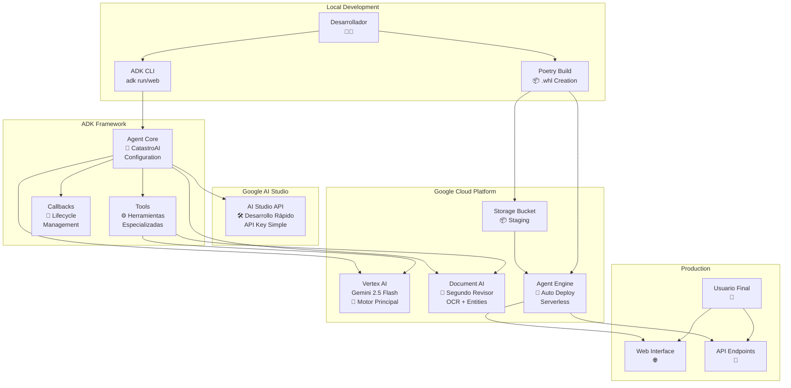
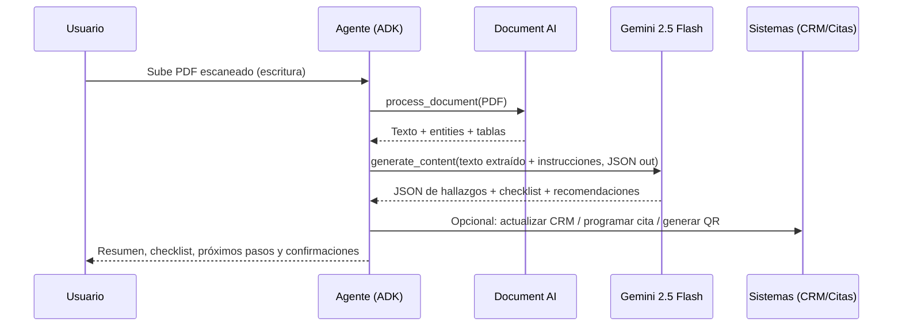
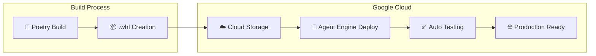

# 🏗️ Arquitectura CatastroAI - Documentación Técnica

## 🎯 Resumen Ejecutivo

**CatastroAI** implementa una **arquitectura híbrida multimodal** que combina las capacidades de **Vertex AI** y **Google AI Studio** a través del **Agent Development Kit (ADK)** de Google. El sistema utiliza una estrategia de **doble validación** con **Gemini 2.5 Flash** como motor principal y **Document AI** como segundo revisor especializado, optimizado para documentos catastrales.

## 📊 Diagrama de Arquitectura



## 🧠 Arquitectura de IA Híbrida

### Componentes Principales

#### 1. **Motor Principal: Gemini 2.5 Flash (Vertex AI)**
- **Función**: Conversación, razonamiento y coordinación general
- **Capacidades**: Multimodal (texto, imagen), context window extendido
- **Integración**: A través de Vertex AI con autenticación Service Account
- **Uso**: Análisis semántico, generación de respuestas, toma de decisiones

#### 2. **Segundo Revisor: Document AI**
- **Función**: Extracción y validación de documentos oficiales
- **Capacidades**: OCR avanzado, extracción de entidades, análisis de formularios
- **Especialización**: Documentos catastrales preentrenados
- **Uso**: Validación de documentos críticos, extracción de datos estructurados

#### 3. **Doble Validación**
```python
def hybrid_processing_pipeline(document_input):
    # Paso 1: Document AI - Extracción estructurada
    extracted_data = document_ai_processor.extract(document_input)
    
    # Paso 2: Gemini - Razonamiento semántico  
    gemini_analysis = gemini_model.analyze(extracted_data)
    
    # Paso 3: Validación cruzada
    return cross_validate(extracted_data, gemini_analysis)
```

## 🔄 Flujo de Procesamiento

### Diagrama de Secuencia



### Estados del Procesamiento

1. **📥 Ingesta**: Recepción de documento (PDF, imagen, texto)
2. **🔍 Análisis Primario**: Document AI extrae estructura y entidades
3. **🧠 Razonamiento**: Gemini interpreta y contextualiza
4. **✅ Validación**: Ambos modelos confirman resultados críticos
5. **📋 Acción**: Herramientas ejecutan próximos pasos
6. **📤 Respuesta**: Usuario recibe información procesada

## 🛠️ Configuración de APIs

### Vertex AI vs Google AI Studio

| Aspecto | Vertex AI | Google AI Studio |
|---------|-----------|------------------|
| **Propósito** | Producción empresarial | Desarrollo y prototipado |
| **Autenticación** | Service Account (A2A) | API Key |
| **Escalabilidad** | Enterprise grade | Desarrollo limitado |
| **Integración** | Nativa con GCP | Standalone |
| **Deployment** | Agent Engine + Cloud Run | No nativo |
| **Monitoreo** | Cloud Monitoring integrado | Básico |
| **Costos** | Facturación empresarial | Pay-per-use simple |
| **SLA** | Garantías empresariales | Best effort |

### Configuración de Desarrollo

```bash
# Opción A: Google AI Studio (Desarrollo rápido)
GOOGLE_GENAI_USE_VERTEXAI=false
GOOGLE_API_KEY=your-api-key-from-studio

# Opción B: Vertex AI (Producción)
GOOGLE_GENAI_USE_VERTEXAI=true
GOOGLE_CLOUD_PROJECT=catastrai-deval
GOOGLE_CLOUD_LOCATION=us-central1
GOOGLE_APPLICATION_CREDENTIALS=./credentials/catastro-ai-credentials.json
```

## 🚀 ADK (Agent Development Kit)

### ¿Qué es el ADK?

El **Agent Development Kit** es un framework de Google que:
- **Abstrae la complejidad** de integración con servicios de IA de Google
- **Maneja automáticamente** la conexión con Vertex AI/AI Studio
- **Proporciona herramientas** para construcción rápida de agentes
- **Facilita deployment** con un comando

### Arquitectura del ADK

```python
from google.adk import Agent

root_agent = Agent(
    model="gemini-2.5-flash",                 # Backend LLM
    global_instruction=GLOBAL_INSTRUCTION,   # Contexto global
    instruction=INSTRUCTION,                  # Comportamiento específico
    tools=[                                   # Herramientas especializadas
        analyze_cadastral_image,              # Vertex AI Vision
        extract_with_document_ai,             # Document AI OCR
        schedule_assessment_service,          # Integración CRM
        send_call_companion_link,             # Video llamadas
        generate_qr_code,                     # Códigos QR
        # ... más herramientas
    ],
    before_tool_callback=before_tool,         # Hooks del ciclo de vida
    after_tool_callback=after_tool,
    before_model_callback=rate_limit_callback
)
```

### Herramientas Especializadas

```python
@tool
def analyze_cadastral_document(
    file_uri: str, 
    output_mode: Literal["features", "summary", "ocr"] = "features"
) -> dict:
    """
    Herramienta híbrida que combina Document AI + Gemini
    para análisis completo de documentos catastrales.
    """
    # 1. Extracción con Document AI
    extracted = extract_with_document_ai(
        project_id="catastrai-deval",
        location="us",
        processor_id="PROCESSOR_ID",
        file_bytes=file_bytes,
        mime_type="application/pdf"
    )
    
    # 2. Análisis semántico con Gemini
    analysis = analyze_with_gemini(
        project_id="catastrai-deval",
        location="us-central1", 
        instruction="Analiza documento catastral",
        extracted_text=extracted["text"],
        output_mode=output_mode
    )
    
    return {
        "docai_extraction": extracted,
        "gemini_analysis": analysis,
        "confidence": calculate_cross_validation_score(extracted, analysis)
    }
```

## 🚀 Auto Deployment Pipeline

### Proceso Automatizado



### Comandos de Deployment

```bash
# 1. Construir archivo wheel
poetry build --format=wheel --output=deployment

# 2. Desplegar automáticamente
cd deployment
python deploy.py

# 3. Verificar deployment
poetry run python setup_gcp_a2a.py
```

### Código de Deployment

```python
# deployment/deploy.py
import vertexai
from vertexai import agent_engines
from vertexai.preview.reasoning_engines import AdkApp

# Configuración automática
vertexai.init(
    project="catastrai-deval",
    location="us-central1",
    staging_bucket="gs://catastrai-deval-adk-customer-service-staging"
)

# Creación y deployment
app = AdkApp(agent=root_agent, enable_tracing=False)
remote_app = agent_engines.create(
    app,
    requirements=["./customer_service-0.1.0-py3-none-any.whl"],
    extra_packages=["./customer_service-0.1.0-py3-none-any.whl"]
)

# Testing automático
session = remote_app.create_session(user_id="test_user")
for event in remote_app.stream_query(
    user_id="test_user",
    session_id=session["id"], 
    message="Prueba de deployment",
):
    if event.get("content", None):
        print(f"✅ Agent deployed: {remote_app.resource_name}")
```

## 🔄 Gestión de Estado y Sesiones

### Persistencia
- **Sessions**: Manejadas automáticamente por Agent Engine
- **Estado del Usuario**: Cargado dinámicamente desde CRM simulado
- **Contexto**: Mantenido entre interacciones
- **Escalabilidad**: Serverless con auto-scaling

### Lifecycle Management

```python
# Callbacks del ciclo de vida
def before_tool(tool_name: str, parameters: dict) -> dict:
    """Se ejecuta antes de cada herramienta"""
    logger.info(f"Ejecutando herramienta: {tool_name}")
    return parameters

def after_tool(tool_name: str, result: any) -> any:
    """Se ejecuta después de cada herramienta"""
    logger.info(f"Resultado de {tool_name}: {result}")
    return result

def rate_limit_callback(request) -> any:
    """Control de límites de velocidad"""
    # Implementar throttling si es necesario
    return request
```

## 📊 Ventajas de la Arquitectura

### ✅ Beneficios Técnicos

1. **🔄 Doble Validación**: Precisión excepcional en documentos críticos
2. **🚀 Escalabilidad**: Serverless en Agent Engine con auto-scaling  
3. **🛠️ Modularidad**: Herramientas especializadas y reutilizables
4. **🔒 Seguridad**: Service Accounts con permisos mínimos
5. **📊 Observabilidad**: Tracing y monitoring integrados
6. **🔄 CI/CD**: Deploy automatizado con verificación
7. **💰 Optimización de Costos**: Uso inteligente de APIs según contexto

### ⚡ Beneficios de Negocio

1. **⏱️ Velocidad**: De días a minutos en trámites catastrales
2. **🎯 Precisión**: Menos errores y reprocesos
3. **📈 Escalabilidad**: Manejo de picos de demanda automático
4. **💡 Transparencia**: Respuestas trazables con evidencias
5. **🔧 Mantenimiento**: Actualizaciones sin downtime

## 🔧 Parámetros de Configuración

### Variables de Entorno Principales

```bash
# Proyecto y región
GOOGLE_CLOUD_PROJECT=catastrai-deval
GOOGLE_CLOUD_LOCATION=us-central1

# Credenciales
GOOGLE_APPLICATION_CREDENTIALS=./credentials/catastro-ai-credentials.json

# Configuración del agente
AGENT_MODEL=gemini-2.5-flash
AGENT_NAME=catastro_ai_agent
AGENT_DESCRIPTION="Agente híbrido para servicios catastrales con doble validación"

# Document AI
DOC_AI_PROCESSOR_ID=projects/catastrai-deval/locations/us/processors/PROCESSOR_ID
DOC_AI_PROCESSOR_LOCATION=us

# Staging
STAGING_BUCKET=gs://catastrai-deval-adk-customer-service-staging
```

### Configuración en `customer_service/config.py`

```python
class Config(BaseSettings):
    model_config = SettingsConfigDict(
        env_file="../.env",
        env_prefix="GOOGLE_",
        case_sensitive=True,
    )
    
    # Configuración del agente
    agent_settings: AgentModel = Field(default=AgentModel())
    app_name: str = "catastro_ai_app"
    
    # GCP Settings
    CLOUD_PROJECT: str = Field(default="catastrai-deval")
    CLOUD_LOCATION: str = Field(default="us-central1")
    GENAI_USE_VERTEXAI: str = Field(default="1")
    API_KEY: str | None = Field(default="")
```

## 🧪 Testing y Verificación

### Scripts de Verificación

```bash
# Verificación completa del entorno
poetry run python setup_gcp_a2a.py

# Testing local
adk run customer_service     # CLI interface
adk web                      # Web interface

# Testing de deployment
cd deployment && python deploy.py
```

### Evaluación del Agente

```bash
# Evaluación automática
poetry run pytest eval

# Evaluación especializada
poetry run python -m eval.test_eval

# Tests unitarios
poetry run pytest tests/unit
```

## 📚 Referencias y Documentación

- **[Google ADK Documentation](https://google.github.io/adk-docs/)**
- **[Vertex AI Agent Engine](https://cloud.google.com/vertex-ai/generative-ai/docs/agent-engine/overview)**
- **[Document AI Documentation](https://cloud.google.com/document-ai/docs)**
- **[Gemini API Documentation](https://ai.google.dev/)**

---

## 📞 Soporte Técnico

**Proyecto**: CatastroAI  
**Versión**: 0.1.0  
**Estado**: ✅ **FUNCIONAL** con Document AI integrado  
**Arquitectura**: Híbrida (Gemini 2.5 Flash + Document AI)  
**Deployment**: Automatizado con Agent Engine  
**Documentación**: Ver `CLAUDE.md` para configuración detallada  

🛠️ **Setup rápido**: `poetry run python setup_gcp_a2a.py`  
🚀 **Deploy**: `poetry build && cd deployment && python deploy.py`  
📊 **Monitor**: Vertex AI Console > Agent Engine
