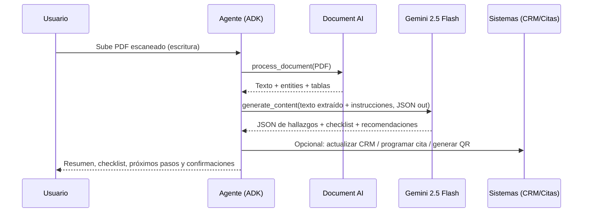

## Flujo integrado: Gemini 2.5 Flash + Document AI para CatastroAI

Este documento describe, de forma clara para negocio y detallada para devs, cómo se integra Google Document AI (extracción OCR/estructuras) y Gemini 2.5 Flash (razonamiento multimodal) dentro del agente CatastroAI basado en ADK.

### Para el pitch (negocio)

- **Qué resuelve**: Convertimos PDFs/planos escaneados en datos confiables y estructurados con Document AI y luego usamos Gemini 2.5 Flash para interpretar, validar y recomendar el siguiente paso del trámite catastral.
- **Beneficios clave**:
  - **Velocidad**: Días a minutos. OCR automático + resumen y checklist inteligentes.
  - **Calidad**: Menos reprocesos; extracción estructurada y verificación semántica.
  - **Transparencia**: Respuestas trazables con JSON y evidencias.
  - **Escala**: Despliegue en Vertex AI Agent Engine / Cloud Run (serverless).
- **Casos demostrables**:
  - Subir una escritura PDF escaneada → extracción de texto/tablas → resumen y checklist de requisitos → propuesta de cita/seguimiento.
  - Subir un plano/fotografía de parcela → lectura visual (Gemini) → detección de linderos/medidas → JSON de features para avalúo.

### Diagrama de arquitectura (alto nivel)

```mermaid
flowchart TD
    U[Usuario] -->|Chat / Sube PDF o Imagen| A[Agente CatastroAI (ADK)]
    A --> R{¿Tipo de entrada?}
    R -->|PDF/Escaneado| DAI[Document AI Processor\n(OCR + Entities + Tables)]
    R -->|Imagen/Plano| GV[Gemini 2.5 Flash Visión]
    DAI --> XT[Texto + Estructura JSON]
    XT --> GR[Gemini 2.5 Flash Razonamiento\n(JSON estructurado final)]
    GV --> GR
    GR --> T[Herramientas del Agente\n(CRM, Citas, QR, Estado)]
    T --> UO[Respuesta al Usuario]
    T --> S[Estado de Sesión / Registros]
```

### Diagrama de secuencia (interacción típico PDF)



## Para desarrolladores (implementación)

### Puntos de integración en el repo

- `customer_service/config.py`: define proyecto, región y modelo (Gemini 2.5 Flash).
- `customer_service/tools/tools.py`: ya integra Gemini para imágenes con `analyze_cadastral_image(...)`. Aquí puedes añadir una herramienta hermana para documentos PDF con Document AI.
- `setup_gcp_a2a.py`: verificación rápida de credenciales/entorno GCP (ADC) y conexión a Vertex AI.

### Variables necesarias

- **GCP/Vertex**: `GOOGLE_CLOUD_PROJECT`, `GOOGLE_CLOUD_LOCATION` (ej. `us-central1`), `GOOGLE_APPLICATION_CREDENTIALS`.
- **Document AI**: `DOC_AI_PROCESSOR_ID` (Form Parser/General), `DOC_AI_PROCESSOR_LOCATION` (ej. `us`).

### Código: extracción con Document AI (PDF/JPG/TIFF)

```python
from typing import Dict, Any
from google.cloud import documentai_v1 as documentai

def extract_with_document_ai(
    project_id: str,
    location: str,          # "us" o "eu"
    processor_id: str,
    file_bytes: bytes,
    mime_type: str = "application/pdf",
) -> Dict[str, Any]:
    client = documentai.DocumentProcessorServiceClient()
    name = client.processor_path(project_id, location, processor_id)

    raw_document = documentai.RawDocument(content=file_bytes, mime_type=mime_type)
    request = documentai.ProcessRequest(name=name, raw_document=raw_document)
    result = client.process_document(request=request)
    doc = result.document

    # Resumen mínimo útil para downstream
    entities = [
        {
            "type": e.type_,
            "mention_text": e.mention_text,
            "confidence": e.confidence,
        }
        for e in doc.entities
    ]
    return {
        "text": doc.text or "",
        "entities": entities,
        "pages": len(doc.pages),
    }
```

### Código: razonamiento con Gemini 2.5 Flash (JSON out)

```python
import json
import vertexai
from vertexai.generative_models import GenerativeModel, GenerationConfig

def analyze_with_gemini(
    project_id: str,
    location: str,
    instruction: str,
    extracted_text: str,
    output_mode: str = "features",   # "features" | "summary" | "ocr"
) -> dict:
    vertexai.init(project=project_id, location=location)
    model = GenerativeModel("gemini-2.5-flash")

    prompt = f"""
    Eres un asistente experto en catastro. Dado el TEXTO extraído del documento,
    produce únicamente JSON válido (sin comentarios) con este esquema aproximado:
    {{
      "document_type": string|null,
      "owner_name": string|null,
      "property_id": string|null,
      "key_entities": [{{"type": string, "value": string, "confidence": number}}],
      "checklist": [string],
      "recommendations": [string],
      "confidence": number
    }}
    Modo de salida: {output_mode}. Instrucción adicional: {instruction}
    Si faltan campos, usa null o deja listas vacías.
    """

    config = GenerationConfig(temperature=0.1, top_p=0.9, response_mime_type="application/json")
    response = model.generate_content([prompt, extracted_text], generation_config=config)
    try:
        return json.loads(response.text or "{}")
    except json.JSONDecodeError:
        return {"raw": response.text}
```

### Orquestación: Document AI + Gemini (archivo local como ejemplo)

```python
import mimetypes
from pathlib import Path

def process_and_analyze_document(
    file_path: str,
    project_id: str,
    vertex_location: str,
    docai_location: str,
    docai_processor_id: str,
    output_mode: str = "features",
):
    mime, _ = mimetypes.guess_type(file_path)
    if not mime:
        mime = "application/pdf"

    # 1) Si es PDF/JPG/TIFF escaneado → Document AI
    with open(file_path, "rb") as f:
        file_bytes = f.read()
    extracted = extract_with_document_ai(
        project_id=project_id,
        location=docai_location,
        processor_id=docai_processor_id,
        file_bytes=file_bytes,
        mime_type=mime,
    )

    # 2) Razonamiento semántico y salida estricta JSON → Gemini
    instruction = "Prioriza datos legales y consistencia catastral."
    gemini_json = analyze_with_gemini(
        project_id=project_id,
        location=vertex_location,
        instruction=instruction,
        extracted_text=extracted["text"],
        output_mode=output_mode,
    )

    return {
        "docai": extracted,
        "gemini": gemini_json,
    }
```

### Cómo exponerlo como herramienta ADK (dentro de `customer_service/tools/tools.py`)

> Nota: En el repo ya existe `analyze_cadastral_image(...)` usando Gemini para imágenes. Para documentos, añade una función similar, por ejemplo `analyze_cadastral_document(...)`, que envuelva `process_and_analyze_document(...)` y devuelva un dict JSON.

```python
from typing import Literal
from ..config import Config

def analyze_cadastral_document(
    file_uri: str,
    output_mode: Literal["features", "summary", "ocr"] = "features",
    language: str = "es",
) -> dict:
    """Analiza un documento catastral (PDF/Escaneado) con Document AI y Gemini.
    Devuelve JSON con entidades clave, checklist y recomendaciones.
    """
    configs = Config()
    # Si `file_uri` es ruta local, lee bytes y despacha como en process_and_analyze_document.
    # Si es `gs://` o `http(s)://`, descarga o enruta acorde antes de llamar a Document AI.
    # Retorna el JSON combinado {"docai": ..., "gemini": ...}.
    ...
```

### Alineado con la propuesta de Castro

- **Pipeline único**: primero estructurar (Document AI), luego razonar (Gemini), con salida JSON estricta para integrarse a CRM/citas/expedientes.
- **Multimodal**: imágenes de planos con `analyze_cadastral_image(...)`; PDFs y escaneos con `analyze_cadastral_document(...)`.
- **Operacional**: ejecutar local (ADK CLI/UI) y escalar en Vertex AI Agent Engine o Cloud Run; autenticación A2A con Service Accounts (ADC).

### Operación y despliegue

- Ejecutar verificación: `poetry run python setup_gcp_a2a.py`
- Ejecutar agente (CLI): `adk run customer_service`
- UI web de ADK: `adk web`
- Despliegue (opcional): build wheel y usar `deployment/deploy.py` para Agent Engine.

### Salida JSON esperada (ejemplo)

```json
{
  "document_type": "escritura",
  "owner_name": "Juan Pérez",
  "property_id": "Lote-123",
  "key_entities": [
    {"type": "folio_real", "value": "FR-998877", "confidence": 0.92}
  ],
  "checklist": ["Falta identificación oficial", "Adjuntar avalúo vigente"],
  "recommendations": ["Programar cita para revisión de linderos"],
  "confidence": 0.88
}
```

### Archivos relevantes

- `customer_service/tools/tools.py`: añadir `analyze_cadastral_document(...)` (Document AI + Gemini).
- `customer_service/tools/tools.py`: ya disponible `analyze_cadastral_image(...)` (Gemini visión).
- `customer_service/config.py`: modelo y parámetros GCP.
- `setup_gcp_a2a.py`: validación de entorno y credenciales.


